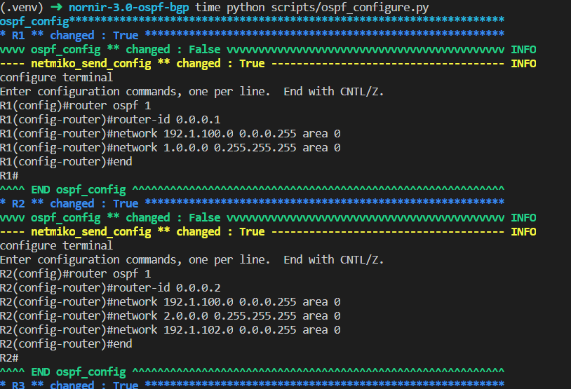

# Nornir-3.0 - Auto OSPF Configuration

## Auto OSPF Configuration
This public repo contains python code that can be used to automate the OSPF configurations of a network. 

The environment is pre-configure for setting the OSPF configuration of my local OSPF topology. You can change the hosts, and networks to be advertised in `inventory/hosts.yaml` to automate 
your OSPF configuraions.

### nw_advertised 
nw_advertised is defined in hosts.yaml as a dictionary of OSPF area keys,
and list of networks to be advertised in each OSPF area as values.
Each Router will advertised some networks in a specific area.

```yaml
R6:
    hostname: 192.168.65.136
    groups:
        - area0
    data:
        id: 6
        nw_advertised: {"0": ["192.1.101.0/24", "6.0.0.0/8", "192.1.67.0/24"]}

R7:
    hostname: 192.168.65.137
    groups:
        - area0
        - area10
    data:
        id: 7
        nw_advertised: {"0": ["192.1.67.0/24", "7.0.0.0/8"], "10": ["192.1.78.0/24"]}

R8:
    hostname: 192.168.65.138
    groups:
        - area10
    data:
        id: 8
        nw_advertised: {"10": ["192.1.78.0/24", "8.0.0.0/8"]}
```

For example, conisder the `nw_advertised` of R7
```yaml
nw_advertised: {"0": ["192.1.67.0/24", "7.0.0.0/8"], "10": ["192.1.78.0/24"]}
```
R7 will advertise 2 networks in area 0: `["192.1.67.0/24", "7.0.0.0/8"]`;
and 1 network in area 10: `["192.1.78.0/24"]`

## Topology 


## Requirements

To use this code you will need:

- Python 3.8+

## Install and Setup
Clone the code to local machine.
```bash
git clone https://github.com/kimdoanh89/nornir-3.0-ospf
cd nornir-3.0-ospf
```

Setup Python Virtual Environment (requires Python 3.8+)
```bash
python3.8 -m venv venv
source venv/bin/activate
pip3 install -r requirements.txt
```
You can edit the variables in the `inventory/hosts.yaml` to set up your OSPF configurations.

## Run

Run the script with the command:
```bash
time python scripts/ospf_configure.py
```

## Output

The output is as follows:




